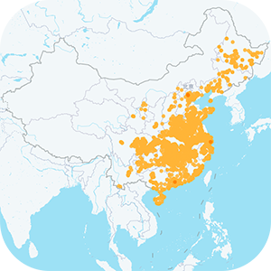

# COVID-19-outbreak_area_data

## 数据源: 

***
**COVID-19疫情区域数据（新冠患者曾活动场所）**  
**！！！不采用非官方民间数据！！！**

### 字段说明

 > 行政区划下的疫情区域数量 [**City.csv**](/data/City.csv)
 >> 字段 | 含义
 >> :---:|:---:
 >> provinceName  | 省份名
 >> provinceId    | 省份编号
 >> provinceTotal | 省份总计疫情区域数量
 >> cityName   | 城市名
 >> cityId     | 城市编号
 >> cityLon    | 城市经度
 >> cityLat    | 城市纬度
 >> cityLevel  | 定位精度
 >> cityCount  | 城市疫情区域数量
 >>
 > 具体疫情地区信息 [**Pois.csv**](/data/Pois.csv)
 >
 >> 字段 | 含义
 >> :---:|:---:
 >> poiname | 疫情地点名
 >> lon     | 经度
 >> lat     | 纬度
 >> tag     | 地点类型
 >> source  | 信息来源
 >>

## 声明
###### 以下声明均直接引自高德
> - 为确保数据准确性和权威性，疫情场所数仅采用各地卫健委、政府等官方来源。
> - 官方目前未公布所有疫情场所，部分城市暂未收录。
> - 官方目前仅公布了部分确诊患者的活动场所，因此疫情场所数不等同于各地新冠肺炎确诊人数。

##### *赶时间的产物，难免粗陋，望理解*

