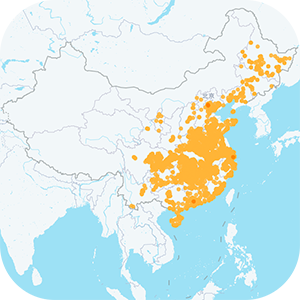

# COVID-19-outbreak_area_data

### COVID-19疫情区域及患者活动轨迹数据

### 数据源:  

### 字段说明

> 行政区划下的疫情区域数量 [**City.csv**](https://github.com/WH-2099/COVID-19-outbreak_area_data/tree/master/data/City.csv)
>> 字段 | 含义
>> :---:|:---:
>> provinceName  | 省份名
>> provinceId    | 省份编号
>> provinceTotal | 省份总计疫情区域数量
>> cityName   | 城市名
>> cityId     | 城市编号
>> cityLon    | 城市经度
>> cityLat    | 城市纬度
>> cityLevel  | 定位精度
>> cityCount  | 城市疫情区域数量
>
> 具体疫情区域信息 [**Pois.csv**](https://github.com/WH-2099/COVID-19-outbreak_area_data/tree/master/data/Pois.csv)
>
>> 字段 | 含义
>> :---:|:---:
>> poiname | 疫情地点名
>> lon     | 经度
>> lat     | 纬度
>> tag     | 地点类型
>> source  | 信息来源
>
> 患者活动轨迹（文本描述） [**Tracke.csv**](https://github.com/WH-2099/COVID-19-outbreak_area_data/tree/master/data/Tracke.csv)
>> 字段 | 含义
>> :---:|:---:
>> id              | 编号
>> province        | 省份名
>> city            | 城市名
>> base_info       | 患者基础信息
>> detail_info     | 详细活动轨迹信息
>> source          | 信息来源
>> is_from_outside | 是否为境外输入
>
> 公众人物感染情况 [**Popular.csv**](https://github.com/WH-2099/COVID-19-outbreak_area_data/tree/master/data/Popular.csv)
>> 字段 | 含义
>> :---:|:---:
>> title     | 标题
>> event     | 事件详情
>> eventTime | 事件时间
>
## 声明
###### 以下声明均直接引自数据源
> - 为确保数据准确性和权威性，疫情场所数仅采用各地卫健委、政府等官方来源。
> - 官方目前未公布所有疫情场所，部分城市暂未收录。
> - 官方目前仅公布了部分确诊患者的活动场所，因此疫情场所数不等同于各地新冠肺炎确诊人数。
> - 确诊者信息持续收集中，仅收录官方公布的信息。

## 开源许可
本项目采用MIT许可证开源，具体信息参见[**LICENSE**](/LICENSE)

